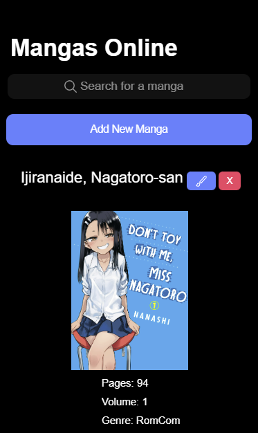
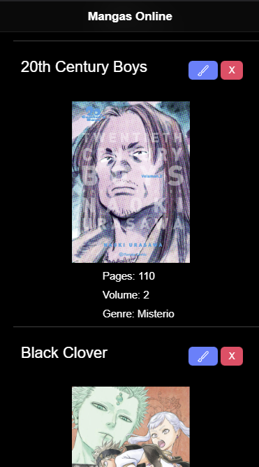

Manga App:

This is an app developed using Spring Boot, Ionic and MySQL for class. It's objective is to have a completely functional crud using a REST API model.

This project has, in the frontend, a list with all the mangas that are in the database, in which they show their image, title, pages... A searchbar in which you can look up any mangas by their title for example (this was something not explained in class), buttons which delete a manga from the database, update them using a form to change their attributes or even create a brand new one filling the form with their respective attributes. The parameters users send to the web service also are controlled, so there can't be no errors in creating a new manga or updating it.

And in the backend we have the 4 CRUD methods get, delete, post and put, and also a get but searching by id that is used for the put, and another in which you can look up mangas by their genre and a List of manga is returned (this also wasn't explained in class). They all work in their respective endpoints, as documented in the Postman.

Postman Link in which the endpoints are documented: https://documenter.getpostman.com/view/23431388/2s83tDpt1H

This app as it was done in Ionic is for mobile exclusively, so the design was done thinking on that.

And that's all. :)
